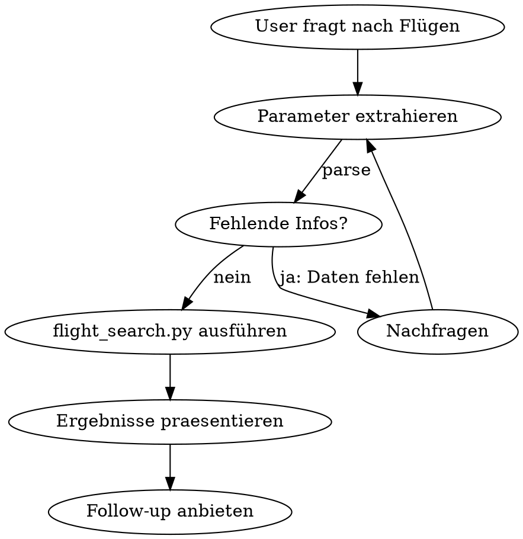

# Flight Search (Amadeus API)

## Overview

Search cheapest flights from any origin to warm/popular destinations via Amadeus Self-Service API. Parses natural language, calls `~/Projects/flight-search/flight_search.py`, presents results.

## Tracking + Self-Heal (PFLICHT — 1 Bash-Call)

Am Anfang jeder Flugsuche:

```bash
RUN_ID=$(./tools/skill-tracker.py start flights --context '{"origin": "FRA", "group": "warm"}') && \
./tools/skill-tracker.py heal flights
```

Ersetze `origin` und `group` mit den tatsächlichen Werten aus der User-Anfrage.

**heal-Output beachten:** Bekannte Fehler-Patterns vermeiden. Reflexionen aktiv berücksichtigen.

## When to Use

- User asks "guenstigste Flüge nach ..."
- User wants to explore "wohin für unter X EUR"
- User mentions specific routes (FRA -> TFS)
- User asks about vacation/travel flight options

## Core Tool

```bash
# Gruppen-Suche (breit):
/usr/bin/python3 ~/Projects/flight-search/flight_search.py \
  --origin FRA \
  --group warm \
  --date-from 2026-03-01 \
  --date-to 2026-03-08 \
  --min-days 3 --max-days 6 \
  --adults 1

# Spezifische Ziele (komma-getrennt, KEINE Leerzeichen):
/usr/bin/python3 ~/Projects/flight-search/flight_search.py \
  --origin FRA \
  --destinations TFS,AYT,PMI \
  --date-from 2026-03-01 \
  --date-to 2026-03-08 \
  --min-days 3 --max-days 6 \
  --adults 1
```

**WICHTIG**: `--destinations` nimmt einen einzigen komma-getrennten String OHNE Leerzeichen.
- Richtig: `--destinations TFS,LPA,AYT`
- FALSCH: `--destinations TFS LPA AYT` (wird als separate Argumente geparst und schlaegt fehl)

## Parameter Extraction

Parse from natural language into these arguments:

| Parameter | Default | Extract from |
|-----------|---------|--------------|
| `--origin` | FRA | "ab Frankfurt", "von HHN", IATA code |
| `--group` | warm | "warme Ziele", "Kanaren", "Türkei" etc. |
| `--destinations` | - | Komma-getrennt, EIN String: "Teneriffa und Gran Canaria" -> `TFS,LPA` |
| `--date-from` | - | "ab 1. März" -> 2026-03-01 |
| `--date-to` | - | "bis 8. März" -> 2026-03-08 |
| `--min-days` | 3 | "mindestens 3 Tage", "3-6 Tage" |
| `--max-days` | 6 | "maximal 6 Tage", "eine Woche" |
| `--adults` | 1 | "2 Erwachsene", "alleine" -> 1 |
| `--json` | - | Only if you need structured data for follow-up |

## Destination Groups

| Group | Destinations |
|-------|-------------|
| `warm` | Kanaren, Türkei, Spanien, Ägypten, Marokko, Faro, Malta, Griechenland |
| `kanaren` | Teneriffa, Gran Canaria, Fuerteventura, Lanzarote |
| `tuerkei` | Antalya, Dalaman, Bodrum |
| `spanien` | Mallorca, Malaga, Alicante, Barcelona |
| `griechenland` | Athen, Kreta, Rhodos, Thessaloniki |
| `aegypten` | Hurghada, Sharm el-Sheikh |
| `nordafrika` | Marrakesch, Casablanca, Tunis, Hurghada, Sharm |
| `italien` | Neapel, Sardinien, Catania |
| `portugal` | Faro, Lissabon |
| `kroatien` | Dubrovnik, Split |
| `alles` | Alle 29 Ziele |

Use `--list-groups` to see current mapping.

## Common IATA Codes

| Stadt | Code | Stadt | Code |
|-------|------|-------|------|
| Frankfurt | FRA | Teneriffa | TFS |
| Hahn | HHN | Antalya | AYT |
| Mallorca | PMI | Hurghada | HRG |
| Malaga | AGP | Athen | ATH |
| Gran Canaria | LPA | Marrakesch | RAK |

## Workflow



**Required info** (must ask if missing): date range (date-from + date-to)
**Has defaults**: origin (FRA), group (warm), days (3-6), adults (1)

## Presenting Results

The tool outputs a formatted table. Present it directly, then add:
1. Quick summary: "Athen ab 127 EUR ist am guenstigsten, Antalya ab 154 EUR Nonstop"
2. Context: Nonstop vs Umstieg, Airlines
3. Caveat: "Amadeus TEST-Umgebung - Preise zur Orientierung"
4. Follow-up: "Soll ich ein bestimmtes Ziel genauer anschauen?"

## Metriken + Abschluss (PFLICHT — 1 Bash-Call)

Nach dem Präsentieren der Ergebnisse:

```bash
./tools/skill-tracker.py metrics-batch $RUN_ID '{
  "destinations_searched": 12,
  "results_found": 8,
  "api_errors": 0,
  "price_min_eur": 127,
  "price_max_eur": 389,
  "api_latency_ms": 42000,
  "nonstop_count": 3
}' && \
./tools/skill-tracker.py complete $RUN_ID && \
./tools/skill-tracker.py auto-learn 2>&1 | tail -3
```

Ersetze alle Metriken-Werte mit den echten Zahlen aus der Flugsuche.

## Performance Notes

- ~60 API-Calls max (auto-adaptive), ~40-70 Sekunden
- Use `--group` for broad search, `--destinations` for specific routes (faster)
- Timeout: 120s für Bash-Call setzen
- Timing is printed to stderr automatically

## Edge Cases

| Situation | Action |
|-----------|--------|
| Token expired | Auto-refresh via cached token |
| No results for destination | Shown as missing in output |
| Rate limit (429) | Auto-retry built in |
| User says "HHN" (Hahn) | Use as origin, not in destination list |
| "nächstes Wochenende" | Calculate actual dates from today |
| "flexibel" / "egal wann" | Ask for rough timeframe |
